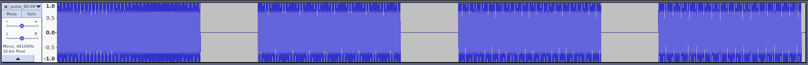
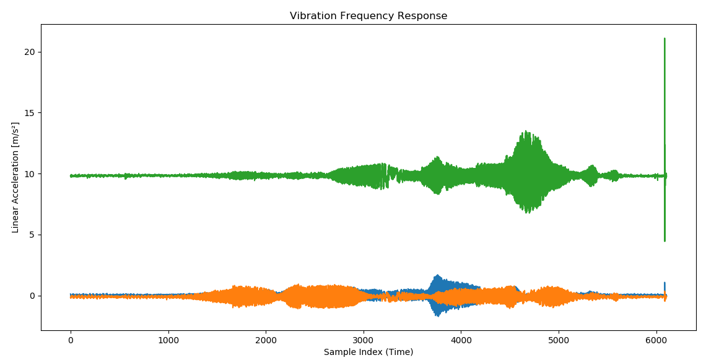
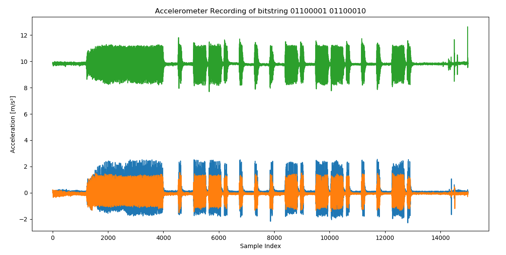

# PET 2018 - Topic 7:  Infrasonic acoustic cross-device tracking
> Beware the malicious baseline!

This project aims at creating a covert channel through very low frequency audio. The idea is that an attacker could encode information in a very low frequency sound signal unhearable by humans. Such a signal could, for example, be played by a malicious website and recorded by a smartphone or laptop microphone. Instead of recording the sound using a microphone, one could also record the vibrations induced by the bass sounds using a smartphone's accelerometer.
The information encoded in the sound signal could then be used to track users of the website or - more generally - to transmit arbitrary information without the users notice.

## Step 1: Experiments

To evaluate the practicability of the attack, we started by performing measurements with different speakers and microphones. Our goal was to detect which frequency range would be playable and recordable using different types of speakers and microphones. Simply speaking, we wanted to find out whether it was even possible to play and record sounds, that could not be heard by humans, using standard consumer hardware.

### Experiment 1: Playability and Audiblitiy

We performed experiments on four different speakers: An expensive professional speaker KRK 5 G3, a JBL 4 portable speaker, the speakers of a Lenovo Thinkpad X230 Laptop, and the speakers of a Xiamoi Redmi Note 5 smartphone.

To evaluate the speakers we created an audio signal that starts at 60Hz and goes down to 0 Hz in 2 Hz steps. Each frequeny is played for 5 seconds with 2 seconds of break in between.



Device | Hearable
--|--
KRK Speaker | > 24 Hz
JBL Speaker | > 48 Hz
Laptop | > 60 Hz
Smartphone | > 60 Hz

The results were overall quite disappointing. The cheaper speakers (i.e. Laptop and Smartphone) were not even able to play sounds at 60 Hz or below and 60 Hz sounds are still clearly audible for human ears.
At least the better speakers (i.e. the KRK and JBL speakers) were able to output lower frequencies. The JBL stopped at 48Hz whereas the KRK was able to go down until 24 Hz which was, however, still audible. Below both speakers just stopped operating and did not produce sounds or vibrations anymore.

### Experiment 2: Recording Audio

### Experiment 3: Recording Vibrations




## Step 2: Implementation

### Server-/Web-Application

The server is written using Python Flask. To set up a development environment:

```bash
cd server
virtualenv -p python3 venv
source venv/bin/activate
pip install -r requirements.txt
python index.py
```


### Mobile Application

The mobile or client application is an Android app written in Kotlin. We use API level 25 and the JDK 8.

Dependencies:

 - TardosDSP


### General Encoding of Text

Text will be encoded using a binary ASCII representation which uses 8 bit for each symbol.
An overview of the conversion can be found [here](https://www.rapidtables.com/code/text/ascii-table.html).

For example, consider the text `test`. This would be converted into the binary string `01110100 01100101 01110011 01110100`.
Each of these bits will be transfered via an audio file, where e.g. 15 Hz represents a 0 and 25 Hz represents a 1. A sound file representing the text `test` can be found in this [repository](https://github.com/Neumann-Nils/PET2018/blob/master/server/sounds/test_15Hz_25Hz_1s_32bit.wav)


### Audio Based Transmission

We use Frequency Shift Keying for audio-based encoding. For development process, currently the audio files use 1 kHz and 10 kHz. However, this shall be changed to use frequencies
below 20 Hz.

Each symbol is played for 1 second, giving a data rate of 1 bits/s.

We use a sampling rate of 44.1 kHz and mono PCM wave files with either 16 or 32 bits sample length.


### Vibration Based Transmission

Symbol duration: 1.5 seconds.

Preamble: 5 symbols of sound followed by 1 symbol of silence

_Ones_ are encoded as `0.8*symbol_duration` of sound followed by silence until the end of the symbol.

_Zeros_ are encoded as `0.2*symbol_duration` of sound followed by silence until the end of the symbol.

There should be at least two symbols of silence before and after every transmission.


